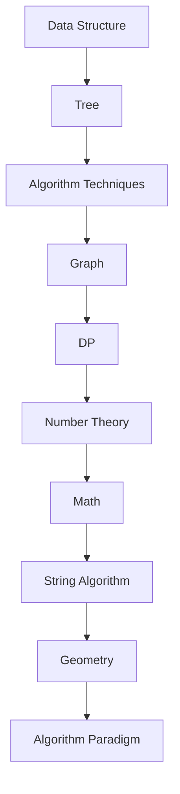
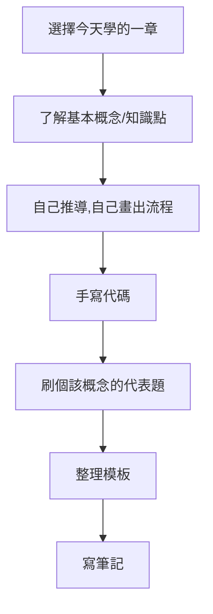

```mermaid
graph TD
    Data_Structure[Data Structure] --> Tree
    Tree --> Algorithm_Techniques[Algorithm Techniques]
    Algorithm_Techniques --> Graph
    Graph --> DP
    DP --> Number_Theory[Number Theory]
    Number_Theory --> Math
    Math --> String_Algorithm[String Algorithm]
    String_Algorithm --> Geometry
    Geometry --> Algorithm_Paradigm[Algorithm Paradigm]

```

---

```mermaid
graph TD
選擇今天學的一章-->了解基本概念/知識點
了解基本概念/知識點 -->自己推導,自己畫出流程
自己推導,自己畫出流程 -->手寫代碼
手寫代碼-->刷個該概念的代表題
刷個該概念的代表題-->整理模板
整理模板-->寫筆記
```
