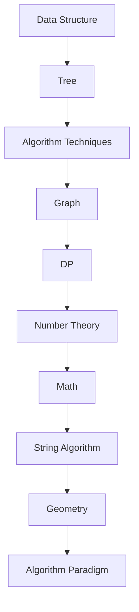

```mermaid
graph TD
    Data_Structure[Data Structure] --> Tree
    Tree --> Algorithm_Techniques[Algorithm Techniques]
    Algorithm_Techniques --> Graph
    Graph --> DP
    DP --> Number_Theory[Number Theory]
    Number_Theory --> Math
    Math --> String_Algorithm[String Algorithm]
    String_Algorithm --> Geometry
    Geometry --> Algorithm_Paradigm[Algorithm Paradigm]

```
